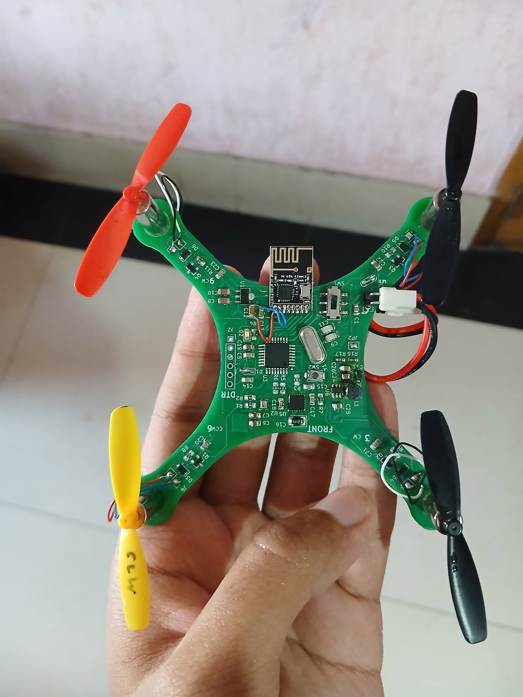
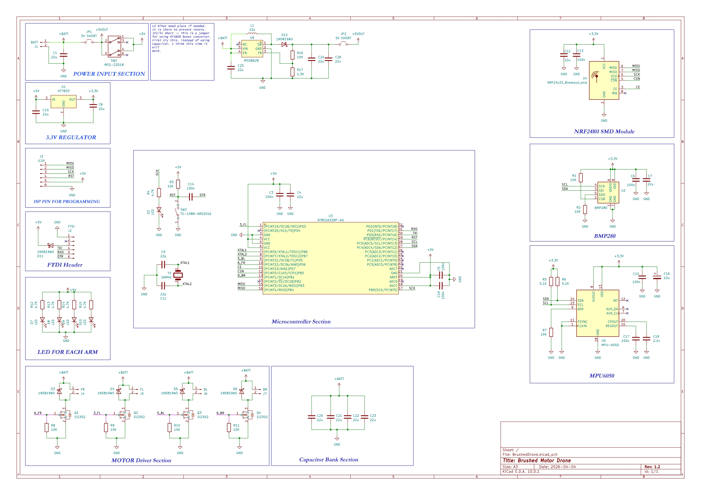
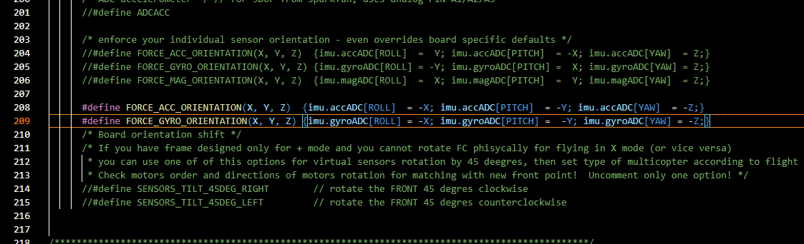
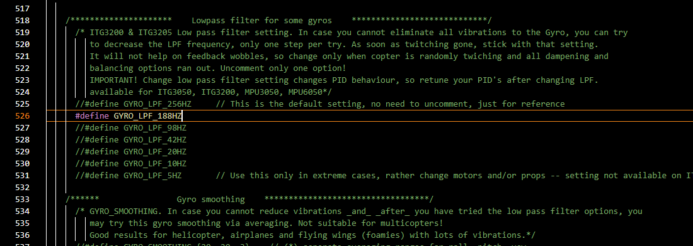
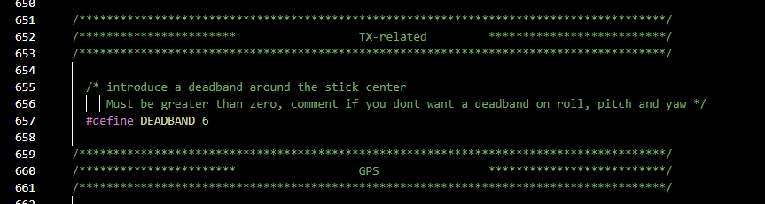
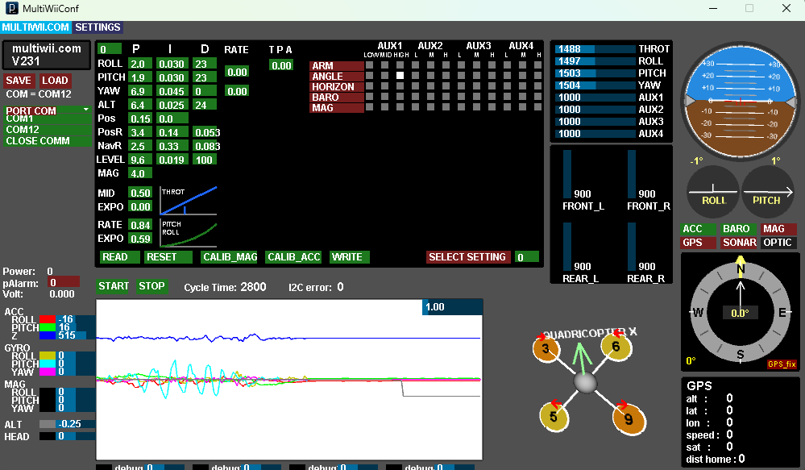
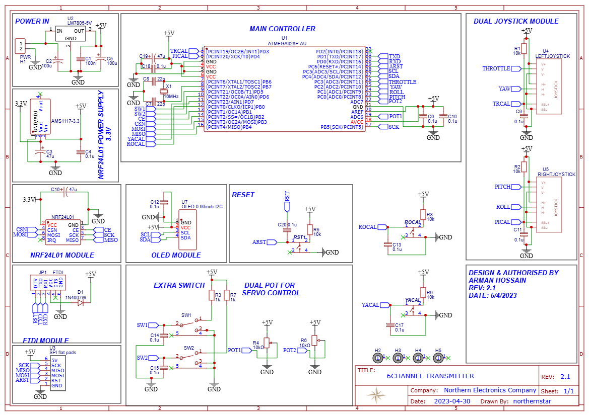
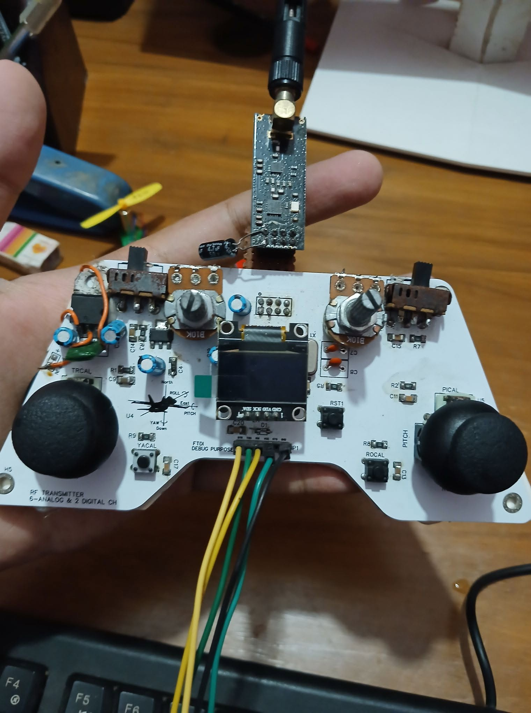

# Multiwii-Brushed-Drone
Brushed Drone with Multiwii

# Orientation Code need to be changed as per MPU6050 Placement

# Vibration Issue mitigated by using low pass filter

# Dead band Added

# Multiwii 2.4 Software picture

#Transmitter Schematic

# Transmitter
